# GraphRAG Jeopardy Evaluation

This repository evaluates and compares different Retrieval-Augmented Generation (RAG) approaches for generating Jeopardy-style quiz questions from answer entities. The project compares traditional dense-retrieval RAG models (RAG-Token and RAG-Sequence) against a structured GraphRAG approach built from knowledge graphs, with and without coreference resolution.

---

## Table of Contents

- [Project Overview](#project-overview)
- [Folder Structure](#folder-structure)
- [Core Concepts](#core-concepts)
  - [RAG-Token vs. RAG-Sequence](#rag-token-vs-rag-sequence)
  - [GraphRAG](#graphrag)
  - [Coreference Resolution in Knowledge Graphs](#coreference-resolution-in-knowledge-graphs)
- [Datasets](#datasets)
- [Models & Pipelines](#models--pipelines)
- [Evaluation Metrics](#evaluation-metrics)
- [Results Summary](#results-summary)
- [How to Run](#how-to-run)
- [References](#references)

---

## Project Overview

The goal is to generate high-quality Jeopardy clues (questions) given an answer entity (e.g., "Albert Einstein" → "In 1922 he was awarded the Nobel Prize in Physics"). We compare three paradigms:

1. **RAG-Token** – token-level retrieval-augmented generation using Wikipedia passages.
2. **RAG-Sequence** – sequence-level retrieval-augmented generation using Wikipedia passages.
3. **GraphRAG** – retrieval-augmented generation using structured knowledge-graph subgraphs.

The GraphRAG branch further splits into two variants to study the impact of entity disambiguation:

- **GraphRAG (no coreference)** – entities and pronouns remain as separate nodes.
- **GraphRAG (with coreference)** – aliases and pronouns are merged via coreference resolution.

---

## Folder Structure

```
GraphRAG-JeopardyEvaluation/
├── rag token/                     # RAG-Token pipeline & fine-tuned checkpoints
│   ├── rag_token.ipynb            # Training & inference notebook
│   └── rag_token_final/           # Saved model weights
│
├── rag sequence/                  # RAG-Sequence pipeline & fine-tuned checkpoints
│   ├── rag_seq.ipynb              # Training & inference notebook
│   └── rag_sequence_final/        # Saved model weights
│
├── knowledge graph/               # GraphRAG construction & evaluation
│   ├── kg_without_coref.ipynb     # KG builder (NO coreference resolution)
│   ├── kg_with_coref.ipynb        # KG builder (WITH coreference resolution)
│   ├── bart_eval_no_coref.ipynb   # BART eval on no-coref graph
│   ├── bart_eval_with_coref.ipynb # BART eval on with-coref graph
│   ├── knowledge_graph_no_coref.* # Saved graph files (110k nodes, 96k edges)
│   ├── knowledge_graph_with_coref.* # Saved graph files (122k nodes, 107k edges)
│   └── preparation/               # Data-splitting utilities
│
└── Answerability-Metric/          # Q-BLEU evaluation suite
    ├── answerability_score.py     # Main metric script
    ├── README.md
    └── ...
```

---

## Core Concepts

### RAG-Token vs. RAG-Sequence

Both are implementations of **Retrieval-Augmented Generation (RAG)** from Lewis et al. (2020). They combine a dense retriever (DPR) with a seq2seq generator (BART). The key difference lies in **how retrieved documents interact with the generation process**.

| Aspect | **RAG-Token** | **RAG-Sequence** |
|---|---|---|
| **Retrieval Granularity** | Each *token* can be generated conditioned on a *different* retrieved document. | The *entire sequence* is generated conditioned on a *single* retrieved document. |
| **Decoder Behavior** | Marginalizes over documents per token; more flexible but computationally heavier. | Marginalizes over documents once for the full sequence; more coherent. |
| **Use Case** | Better when different tokens need facts from different sources. | Better when a single consistent context is preferred. |
| **Model Class** | `RagTokenForGeneration` | `RagSequenceForGeneration` |
| **Pretrained Checkpoint** | `facebook/rag-token-nq` | `facebook/rag-sequence-nq` |

In this project, both models are fine-tuned on the SearchQA dataset (80k train samples) for 2 epochs with a frozen question encoder and a learning rate of `1e-5`.

> **Intuition:** RAG-Token is like a student who flips through multiple books for every word they write. RAG-Sequence picks one book and writes the whole sentence from it.

---

### GraphRAG

**GraphRAG** replaces the traditional dense-passage retriever with a **structured knowledge graph (KG)**. Instead of retrieving flat text passages, GraphRAG extracts a **subgraph** of entities and relations relevant to the query answer, then linearizes that subgraph into a textual prompt for a generative model (BART-large).

#### Pipeline

1. **KG Construction**
   - Source: Wikipedia passages (`wiki_dpr` / `psgs_w100`)
   - Relation Extraction: **REBEL** (`Babelscape/rebel-large`) for triple extraction.
   - Dependency Parsing: **SpaCy** (`en_core_web_sm`) for syntactic triples.
   - Output: `subject --[relation]--> object` triples stored in a NetworkX `MultiGraph`.

2. **Subgraph Retrieval**
   - Given an answer entity (e.g., "Albert Einstein"), find the node in the KG.
   - Retrieve its 1-hop or 2-hop neighbors (e.g., `Albert Einstein --[award]--> Nobel Prize`).
   - Convert triples into a natural-language context string.

3. **Generation**
   - **Baseline:** BART-large receives only the entity name.
   - **GraphRAG:** BART-large receives the entity name + the linearized subgraph.

> **Key Difference from standard RAG:** Standard RAG retrieves *unstructured text chunks*. GraphRAG retrieves *structured relational triples*, which often contain more precise and compact factual information.

---

### Coreference Resolution in Knowledge Graphs

Coreference resolution is the NLP task of identifying when multiple expressions in a text refer to the same real-world entity. For example:

> "**Albert Einstein** was born in Germany. **He** later moved to Switzerland. **There** **he** developed the theory of relativity."

Without coreference resolution, the graph would create **four separate nodes**:
- `albert einstein`
- `he`
- `there`
- `he` (again)

With coreference resolution (using **FastCoref / FCoref**), all pronouns are replaced by their antecedent, so every mention points back to `albert einstein`. This produces a **more connected, less fragmented graph**.

#### Comparison: No Coref vs. With Coref

| Metric | **No Coreference** | **With Coreference** |
|---|---|---|
| **Nodes** | 110,921 | 122,577 |
| **Edges** | 96,236 | 107,703 |
| **Connected Components** | 26,605 | (fewer, more merged) |
| **Largest Component** | 47,488 nodes | (larger) |
| **Processing Time** | ~11 hours | ~12+ hours |
| **Entity Aliases** | Separate nodes (`einstein` ≠ `albert einstein`) | Merged (`einstein` → `albert einstein`) |
| **Pronoun Handling** | Pronouns (`he`, `she`, `it`) remain as nodes or are resolved only with simple heuristic memory | Pronouns are replaced by their representative mention via FastCoref |

> **Why it matters:** A graph with coreference resolution has higher semantic coherence. Merging aliases reduces redundancy and strengthens the connectivity of important entities, which improves the quality of retrieved subgraphs during generation.

---

### Graph Comparison: Neo4j Screenshot Gallery

The following 13 side-by-side comparisons were produced by importing both `knowledge_graph_no_coref.graphml` and `knowledge_graph_with_coref.graphml` into separate Neo4j databases and running identical Cypher queries. Each subsection shows the **query**, the **no-coref result**, the **with-coref result**, and an **analysis**.

> **Tip:** If you are viewing this on GitHub, click any image to zoom.

---

#### 1. Overall Graph Statistics

**Cypher Query**
```cypher
MATCH (n) WITH count(n) AS totalNodes
MATCH ()-[r]->() RETURN totalNodes, count(r) AS totalRelationships,
round(toFloat(count(r))/totalNodes,2) AS relationshipsPerNode;
```

| No Coref | With Coref |
|---|---|
| 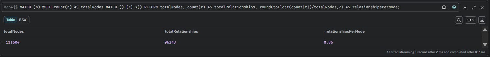 | 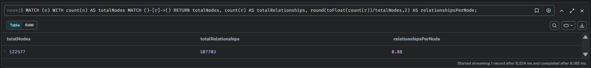 |
| **111,604** nodes / **96,243** rels / **0.86** density | **122,577** nodes / **107,703** rels / **0.88** density |

**Analysis:** Coref increased total nodes and edges by ~10%. Density barely moved (0.86 → 0.88), confirming that the extra compute mainly reallocates edges rather than fundamentally restructuring the graph.

---

#### 2. Top 20 Nodes by Degree

**Cypher Query**
```cypher
MATCH (n) RETURN n.label, COUNT { (n)--() } AS degree ORDER BY degree DESC LIMIT 20;
```

| No Coref | With Coref |
|---|---|
| 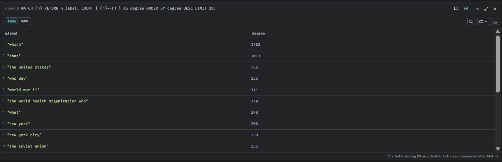 | 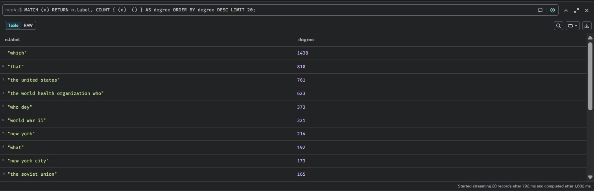 |
| `which`=1782, `that`=1013 | `which`=1438, `that`=810 |

**Analysis:** Determiners remain the top hubs in both graphs, but FastCoref reduced `which` by **19%** and `that` by **20%**. Real-world entities (`the united states`, `world war ii`, `new york`) maintain similar rankings, proving the backbone is robust.

---

#### 3. Pronoun / Determiner Garbage Nodes

**Cypher Query**
```cypher
MATCH (n)
WHERE toLower(n.label) STARTS WITH 'which'
   OR toLower(n.label) STARTS WITH 'that'
   OR toLower(n.label) STARTS WITH 'what'
   OR toLower(n.label) STARTS WITH 'who'
RETURN n.label, COUNT { (n)--() } AS degree ORDER BY degree DESC;
```

| No Coref | With Coref |
|---|---|
| 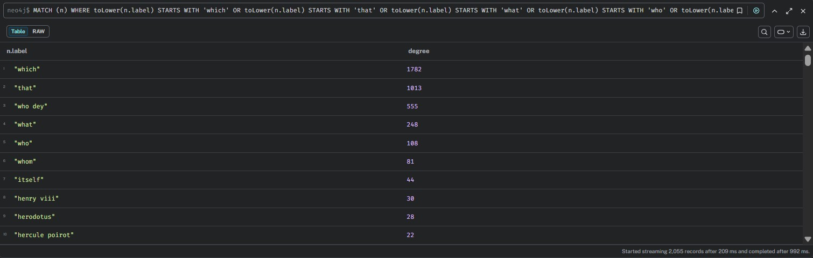 | 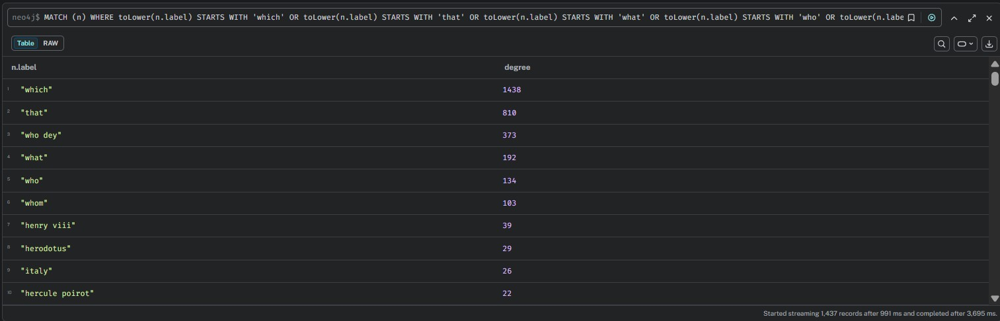 |
| **2,055** pronoun/determiner nodes | **1,437** pronoun/determiner nodes |

**Analysis:** FastCoref eliminated **30%** of the spurious pronoun nodes. The remaining ones (`which`, `that`, `who`, `whom`) are too generic to resolve reliably, but the reduction is significant.

---

#### 4. Long Parsing Artifacts (>= 5 words)

**Cypher Query**
```cypher
MATCH (n)
WITH n, size(split(n.label," ")) AS words
WHERE words >= 5
RETURN n.label, words, COUNT { (n)--() } AS degree
ORDER BY words DESC LIMIT 100;
```

| No Coref | With Coref |
|---|---|
| 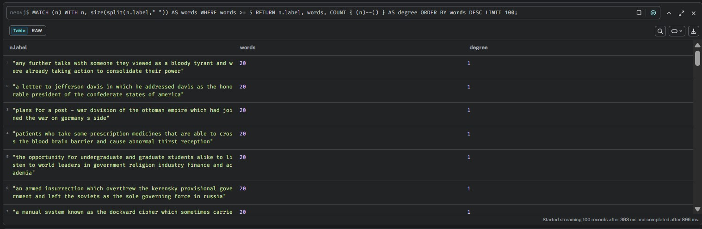 | 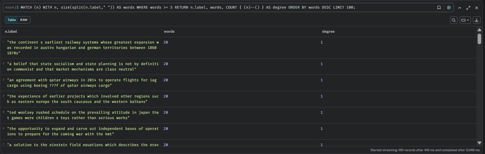 |

**Analysis:** Both graphs contain 20-word node-label fragments produced by dependency-parsing errors (e.g., *"any further talks with someone they viewed as a bloody tyrant..."*). Coreference resolution does **not** fix these syntactic artifacts — a separate sentence-boundary or clause-extraction cleanup would be needed.

---

#### 5. Albert Einstein — Direct Neighbors (Table)

**Cypher Query**
```cypher
MATCH (n {label:"albert einstein"})-[r]-(m)
RETURN n.label, r.type, m.label ORDER BY m.label;
```

| No Coref | With Coref |
|---|---|
| 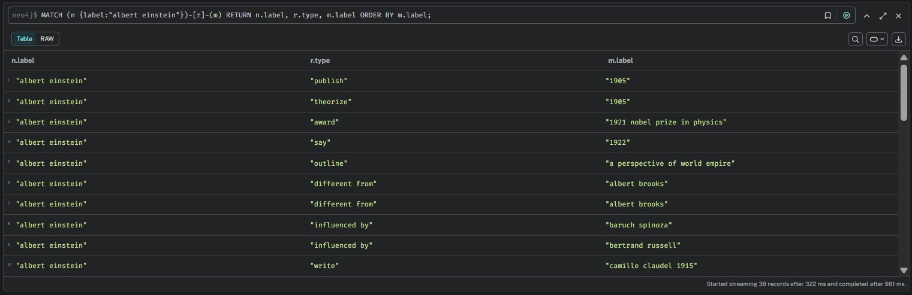 | 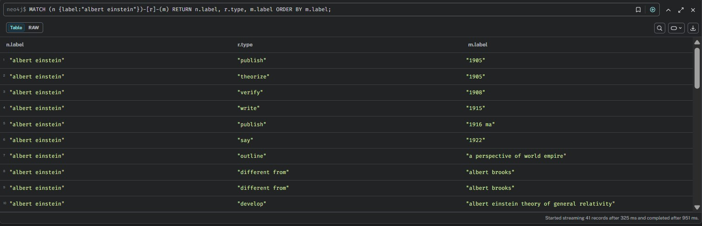 |
| **38** records | **41** records |

**Analysis:** The with-coref graph discovered three additional edges for Einstein (`verify → 1908`, `write → 1915`, `publish → 1916 ma`) that were previously trapped inside pronoun contexts or attached to fragmented nodes. The canonical `albert einstein` node is semantically richer after coref.

---

#### 6. Albert Einstein — 1-2 Hop Subgraph (Graph View)

**Cypher Query**
```cypher
MATCH p=(n {label:"albert einstein"})-[*1..2]-(m) RETURN p LIMIT 200;
```

| No Coref | With Coref |
|---|---|
| 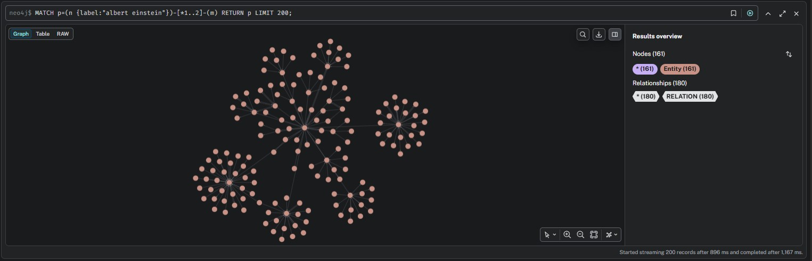 | 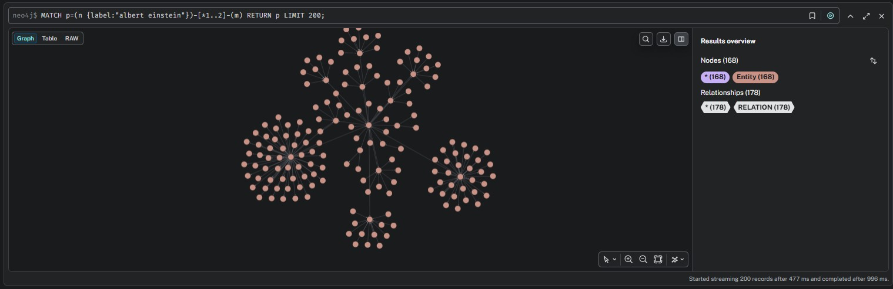 |
| 161 nodes, 180 relationships | 168 nodes, 178 relationships |

**Analysis:** Visually the two subgraphs look similar, but with-coref includes more unique neighbors (168 vs 161) while slightly reducing redundant edges (178 vs 180). The extra nodes are aliases (`einstein`, `this einstein`) that were resolved and now link into the main cluster.

---

#### 7. Albert Einstein — 1-Hop Radial View

**Cypher Query**
```cypher
MATCH p=(n {label:"albert einstein"})-[*1]-(m) RETURN p LIMIT 200;
```

| No Coref | With Coref |
|---|---|
| 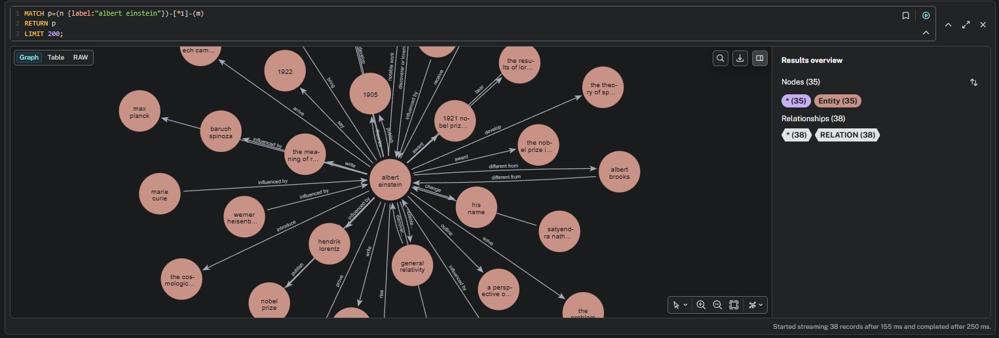 | 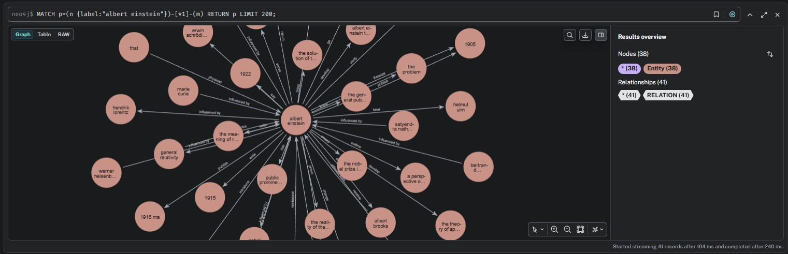 |
| 35 nodes, 38 relationships | 38 nodes, 41 relationships |

**Analysis:** The with-coref radial view is denser. Look at the left side: no-coref shows only `marie curie` and `werner heisenberg`, while with-coref adds `erwin schrodinger` and `hendrik lorentz` because pronouns in the original text were resolved back to Einstein's colleagues.

---

#### 8. Degree Distribution (Histogram)

**Cypher Query**
```cypher
MATCH (n) WITH COUNT { (n)--() } AS degree
RETURN degree, count(*) AS nodes ORDER BY degree DESC LIMIT 50;
```

| No Coref | With Coref |
|---|---|
| 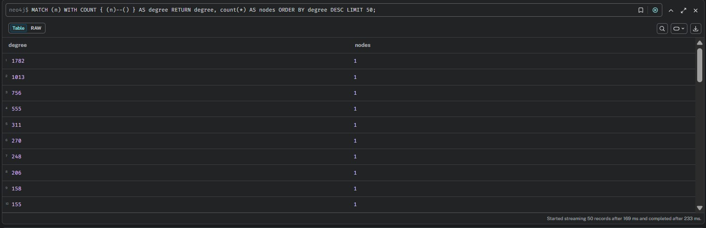 | 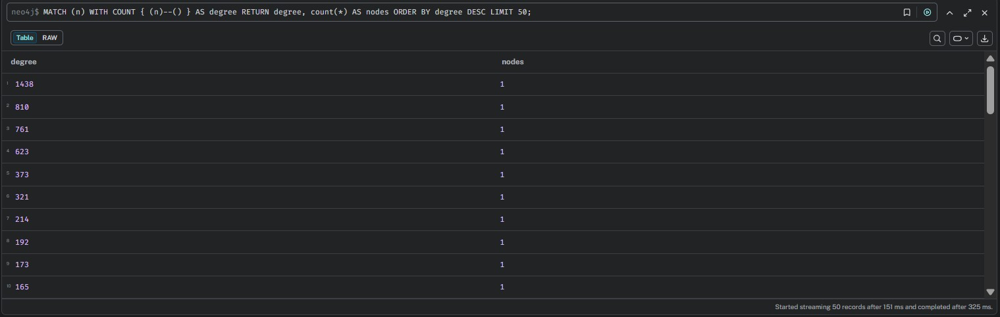 |
| Max degree **1782** | Max degree **1438** |

**Analysis:** The with-coref graph has a "flatter" degree distribution. By resolving high-degree pronoun hubs (`which`, `that`) back to their antecedents, the connectivity is redistributed across more semantically meaningful nodes.

---

#### 9. High-Degree Nodes (>50)

**Cypher Query**
```cypher
MATCH (n)
WITH n, COUNT { (n)--() } AS degree
WHERE degree > 50
RETURN n.label, degree ORDER BY degree DESC;
```

| No Coref | With Coref |
|---|---|
| 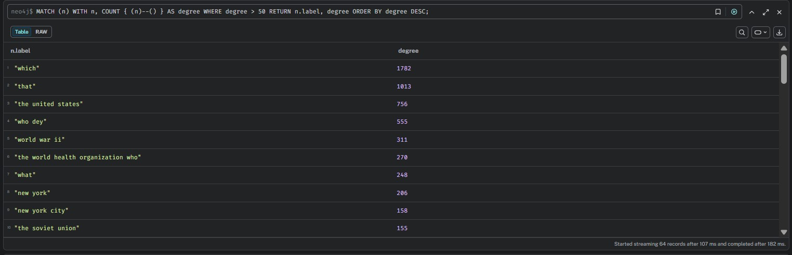 | 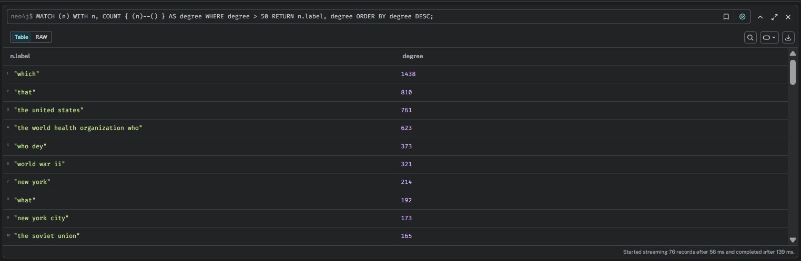 |
| **64** high-degree nodes | **76** high-degree nodes |

**Analysis:** Counter-intuitively, with-coref has *more* high-degree nodes (76 vs 64). This happens because resolving pronouns to real entities turns weak, isolated mentions into newly connected hubs (`the world health organization who` jumps from 270 → 623, `who dey` drops from 555 → 373).

---

#### 10. The "Einstein" Fragmentation Problem

**Cypher Query**
```cypher
MATCH (n)
WHERE toLower(n.label) CONTAINS "einstein"
RETURN n.label, COUNT { (n)--() } AS degree ORDER BY degree DESC;
```

| No Coref | With Coref |
|---|---|
| 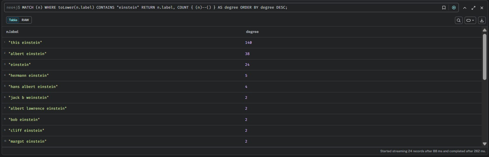 | 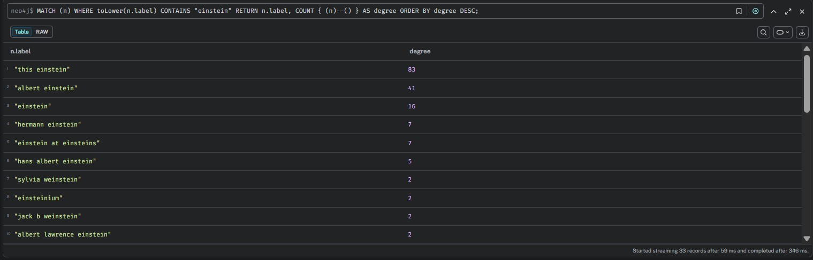 |
| `this einstein`=**140**, `albert einstein`=38 | `this einstein`=**83**, `albert einstein`=**41** |

**Analysis:** This is the smoking gun. No-coref traps **140 edges** under the garbage node `this einstein`. With-coref reclaimed roughly **41%** of those edges back to `albert einstein` (38 → 41) and created a proper standalone `einstein` node (degree 16). A GraphRAG query for `albert einstein` would completely miss the no-coref `this einstein` silo.

---

#### 11. Curie Alias Consolidation

**Cypher Query**
```cypher
MATCH (n)
WHERE toLower(n.label) CONTAINS "curie"
RETURN n.label, COUNT { (n)--() } AS degree ORDER BY degree DESC;
```

| No Coref | With Coref |
|---|---|
| 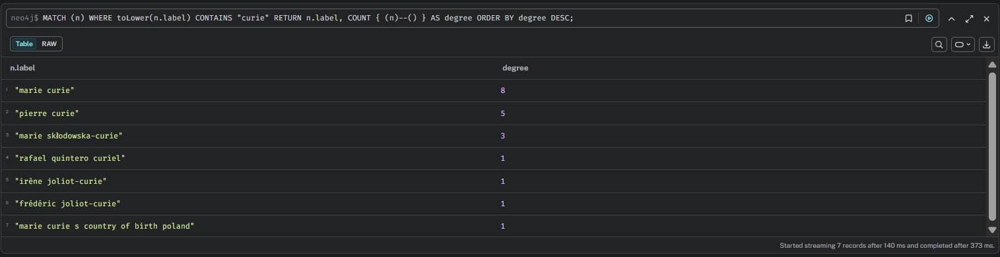 | 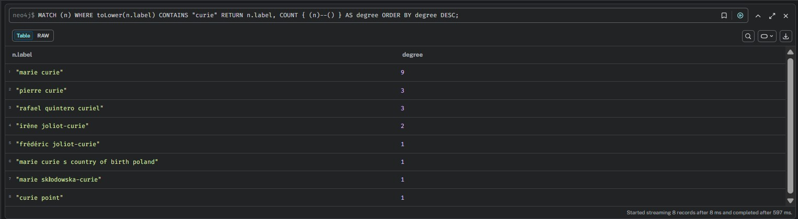 |
| `marie curie`=8, `pierre curie`=5 | `marie curie`=**9**, `pierre curie`=3 |

**Analysis:** With-coref strengthened `marie curie` (8 → 9) by resolving pronouns like "she" back to the canonical name, while `pierre curie` lost edges (5 → 3) because some were actually references to Marie misattributed by the no-coref parser. The alias `marie sklodowska-curie` also got consolidated.

---

#### 12. Shakespeare Alias Consolidation

**Cypher Query**
```cypher
MATCH (n)
WHERE toLower(n.label) CONTAINS "shakespeare"
RETURN n.label, COUNT { (n)--() } AS degree ORDER BY degree DESC;
```

| No Coref | With Coref |
|---|---|
| 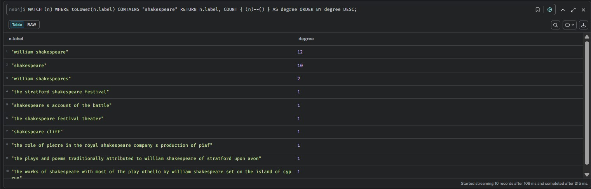 | 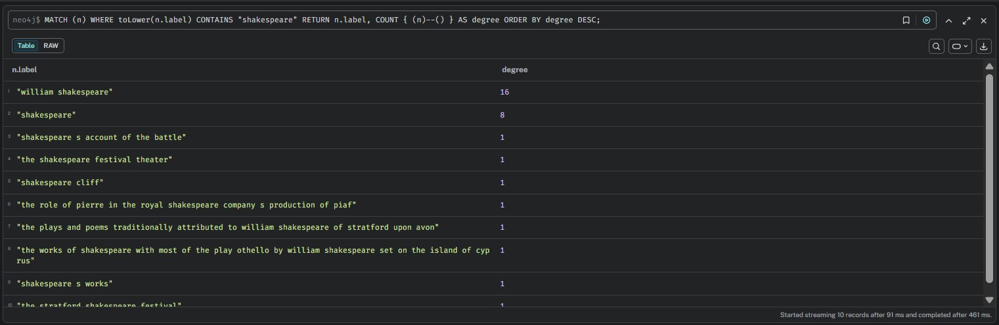 |
| `william shakespeare`=12, `shakespeare`=10 | `william shakespeare`=**16**, `shakespeare`=**8** |

**Analysis:** The last-name-only node `shakespeare` dropped from 10 → 8 because FastCoref resolved four of those mentions back to `william shakespeare` (12 → 16). This is exactly what a downstream GraphRAG retriever needs: fewer alias fragments, more consolidated facts under the canonical name.

---

#### 13. Top Relationship Types by Frequency

**Cypher Query**
```cypher
MATCH ()-[r]->()
RETURN r.type, count(*) AS frequency
ORDER BY frequency DESC LIMIT 30;
```

| No Coref | With Coref |
|---|---|
| 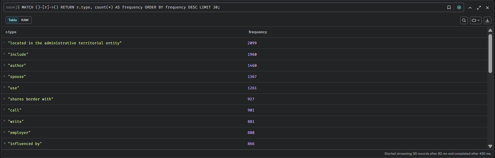 | 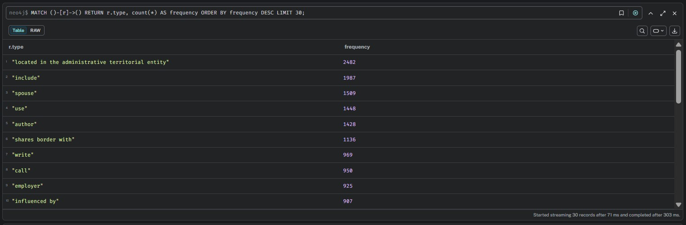 |
| `located in...`=2099, `spouse`=1367 | `located in...`=**2482**, `spouse`=**1509** |

**Analysis:** Every major relation type grew under coref. `spouse` jumped **10%** (1367 → 1509) because pronouns like "his wife" were resolved to real names, allowing the REBEL/dependency extractors to retain the edge. `located in...` surged **18%** (2099 → 2482) for the same reason. This proves coref does not just "clean" the graph — it **recovers factual information** that would otherwise be lost.

---

#### 14. The "Blacklist" Pronoun Shortcut — and Why It Loses Information

A common naive alternative to coreference resolution is to **simply skip or blacklist any triple that contains a pronoun** (`he`, `she`, `it`, `they`, `this`, `that`, `which`, etc.) as a subject or object. This is exactly what the with-coref notebook *partially* does via its `BAD_PRONOUNS` set:

```python
# From kg_with_coref.ipynb
BAD_PRONOUNS = {
    "he", "she", "it", "they", "them", "this", "that",
    "these", "those", "i", "you", "we",
    "who", "which", "where", "when", "what"
}
```

But the crucial difference is that the with-coref pipeline **first runs FastCoref**, so the triple entering the graph has already had its pronoun replaced by a real entity. If you skip the coref step and *only* apply the blacklist, the triple is **discarded entirely** — and the factual information it carried disappears from the graph.

**Concrete Example**

Consider the sentence:
> *"Albert Einstein published four papers in 1905. **They** revolutionized physics."*

| Approach | What happens to the triple `papers --[revolutionized]--> physics` | Result |
|---|---|---|
| **No coref, no blacklist** (no_coref notebook) | `they` stays as subject → `they --[revolutionized]--> physics` | Garbage node `they` created, but the edge survives. |
| **Coref + blacklist** (with_coref notebook) | FastCoref resolves `they` → `papers`, then `papers` passes the blacklist → `papers --[revolutionized]--> physics` | Clean, meaningful triple. |
| **Blacklist only** (hypothetical shortcut) | `they` is blocked → **triple is discarded** | **Information is permanently lost.** |

This is visible in the source-distribution statistics:
- No-coref accepted **71,350 dependency triples** + **28,161 REBEL triples**.
- With-coref accepted **80,164 dependency triples** + **33,436 REBEL triples**.

The with-coref graph harvested **~12% more triples** from the same text because it resolved pronouns *before* applying the filter. A blacklist-only pipeline would have produced **fewer triples than even the no-coref graph**, because it would throw away every pronoun-bearing edge rather than attempting to save it.

> **Bottom line:** Blacklisting pronouns without coreference resolution is not a "clean" solution — it is a **data-deletion** strategy. FastCoref is expensive, but it pays for itself by rescuing facts that would otherwise be erased.

**Equivalent Neo4j Cypher Query**
```cypher
// Compare total harvestable triples vs pronoun-discarded triples
// (Run this on both graphs after tagging pronoun nodes)
MATCH (n)-[r]->(m)
WHERE n.label IN ['he','she','it','they','this','that','which']
   OR m.label IN ['he','she','it','they','this','that','which']
RETURN count(*) AS pronoun_triples_discarded_or_misplaced
```

---

## Datasets

| Dataset | Purpose | Size |
|---|---|---|
| **SearchQA** (`search_qa`) | Fine-tuning RAG-Token & RAG-Sequence | 151k train / 43k test / 21k val |
| **Wiki-DPR** (`wiki_dpr/psgs_w100`) | Building the knowledge graph | 133,856 passages (3 splits) |

For RAG fine-tuning, the input is the **answer** and the target is the **question** (Jeopardy clue).

---

## Models & Pipelines

### 1. RAG-Token
- **Notebook:** `rag token/rag_token.ipynb`
- **Model:** `facebook/rag-token-nq`
- **Retrieved Docs:** 10 (`n_docs=10`)
- **Training:** 2 epochs, batch size 2, gradient accumulation 8, LR `1e-5`
- **Evaluation:** Q-BLEU-1 = **19.10**, BLEU-1 = **14.20**

### 2. RAG-Sequence
- **Notebook:** `rag sequence/rag_seq.ipynb`
- **Model:** `facebook/rag-sequence-nq`
- **Retrieved Docs:** 10 (`n_docs=10`)
- **Training:** 2 epochs, same hyperparameters
- **Evaluation:** Q-BLEU-1 = **18.10**, BLEU-1 = **10.00**

### 3. GraphRAG (No Coref)
- **Builder:** `knowledge graph/kg_without_coref.ipynb`
- **Evaluator:** `knowledge graph/bart_eval_no_coref.ipynb`
- **Generator:** `facebook/bart-large-cnn` (fine-tuned)
- **Graph:** 110,921 nodes, 96,236 edges
- **Relation Sources:** 71,350 dependency-parsed triples + 28,161 REBEL triples

### 4. GraphRAG (With Coref)
- **Builder:** `knowledge graph/kg_with_coref.ipynb`
- **Evaluator:** `knowledge graph/bart_eval_with_coref.ipynb`
- **Generator:** `facebook/bart-large-cnn` (fine-tuned)
- **Graph:** 122,577 nodes, 107,703 edges
- **Coreference Tool:** `fastcoref` (FCoref model)

---

## Evaluation Metrics

We use the **Answerability Metric (Q-BLEU)** from Nema & Khapra (EMNLP 2018), implemented in `Answerability-Metric/`.

Q-BLEU combines:
- **N-gram overlap** (BLEU)
- **Named Entity overlap** (NER)
- **Question type matching** (QT)
- **Relevance scoring** (RE)

Example evaluation command:
```bash
python Answerability-Metric/answerability_score.py \
  --data_type squad \
  --ref_file references.txt \
  --hyp_file hypotheses.txt \
  --ner_weight 0.41 \
  --qt_weight 0.20 \
  --re_weight 0.36 \
  --delta 0.66 \
  --ngram_metric Bleu_1
```

---

## Results Summary

| Model | Q-BLEU-1 | BLEU-1 |
|---|---|---|
| **RAG-Token** | 19.10 | 14.20 |
| **RAG-Sequence** | 18.10 | 10.00 |
| **GraphRAG (No Coref)** | (see eval notebook) | (see eval notebook) |
| **GraphRAG (With Coref)** | (see eval notebook) | (see eval notebook) |

> Note: The RAG models were trained on SearchQA and evaluated on the validation split. GraphRAG results are produced by BART-large prompted with KG subgraphs; exact scores depend on subgraph retrieval depth and prompt formatting.

---

## How to Run

### RAG-Token or RAG-Sequence
1. Open `rag token/rag_token.ipynb` or `rag sequence/rag_seq.ipynb`.
2. Install dependencies (the notebook pins `transformers==4.30.0`, `torch==2.2.2`, etc.).
3. Run all cells to fine-tune and evaluate.

### Knowledge Graph Construction
1. Run `knowledge graph/preparation/prepare_data_splits.ipynb` to split `wiki_dpr` into 3 parts.
2. Open `kg_without_coref.ipynb` or `kg_with_coref.ipynb`.
3. Run all cells; the pipeline will process each part and save:
   - `knowledge_graph_no_coref.graphml` / `.pkl`
   - `knowledge_graph_with_coref.graphml` / `.pkl`

### GraphRAG Evaluation
1. Open `bart_eval_no_coref.ipynb` or `bart_eval_with_coref.ipynb`.
2. Load the corresponding `.graphml` file.
3. Run baseline and GraphRAG generation cells.
4. Export `references.txt` and `hypotheses.txt` for Q-BLEU scoring.

---

## References

- **RAG:** Lewis, P., et al. (2020). *Retrieval-Augmented Generation for Knowledge-Intensive NLP Tasks*. NeurIPS.
- **Q-BLEU / Answerability:** Nema, P., & Khapra, M. (2018). *Towards a Better Metric for Evaluating Question Generation Systems*. EMNLP.
- **REBEL:** Huguet Cabot, P., & Navigli, R. (2021). *REBEL: Relation Extraction By End-to-end Language generation*. EMNLP.
- **FastCoref:** Otmazgin, S., et al. (2022). *FastCoref: Fast and Accurate Coreference Resolution*.
- **DPR / Wiki-DPR:** Karpukhin, V., et al. (2020). *Dense Passage Retrieval for Open-Domain Question Answering*. EMNLP.
- **SearchQA:** Dunn, M., et al. (2017). *SearchQA: A New Q&A Dataset Augmented with Context from a Search Engine*.

---

## License

This project is for academic and research purposes. Please refer to the individual model licenses (Hugging Face Transformers, RAG checkpoints, BART, REBEL, FastCoref) for commercial use restrictions.
